# ESP 8266 RC
this an almost generic firmware project (written for `ESP8266`) for Remote Controlled Cars (RC). 
The remote works over a WIFI connection and in a single-page web application.

This project is still under development and research, so as soon as the hardware is figured out, all the hardware schematics and the PCB (maybe) will be available. 

## Supported Boards:
  - ESP-8266
    - [x] ESP-01
    - [ ] ESP-12
  - ESP-32
    - [ ] ESP-32-WROOM
    - [ ] ESP-32-CAM

## Project structure
  - The project contains the following:
    - Firmware
      - Developed in PlatformIO
      - Arduino Framework
      - Used YMALDuino
      - Used ArduinoJson
      - Used PCF8574
      - [x] Web Server
      - [x] Static File Server
      - [x] Web API
      - [x] mDNS
      - [x] OTA Update
    - Web page static files
      - Used LittleFS
      - Index page `HTML`, `CSS`, `JS` 
      - manifest.json
      - SVG and PNG icons
      - [ ] Config.yml

## Features
  - This firmware currently supports:
    - [x] Head Lights
    - [x] Break Lights
    - [x] Signal Lights
    - [x] Gear System (only `DRIVE`, `NEUTAL`, and `REVERSE` are supported)
    - [x] Horn
    - [ ] Fixed Speed `DC Motor` Drive (`FORWARD` and `REVERSE`)
    - [x] Steering (`Servo` based)
    - [x] Debug Console
  
  - These Features might also be implemented in the near future:
    - [ ] Underglow Lights
    - [ ] Variable Speed `DC Motor` Drive
    - [ ] Steering ('DC Motor' based)
    - [ ] Gear System (`Manual` gear system)
    - [ ] Pneumatic Height Control (`Servo` based)
    - [ ] `Brushless DC Motor` Drive
    - [ ] FPV Camera

## Components:
  
  | Name                       | Image                                            | Count |
  | :---:                      | :---:                                            | :---: |
  | ESP-01                     | 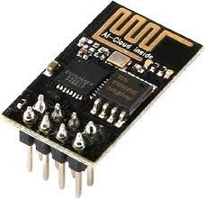        | 1     |
  | Geared hobby RC Motor 1:48 |  | 1     |
  | SG90 servo                 | 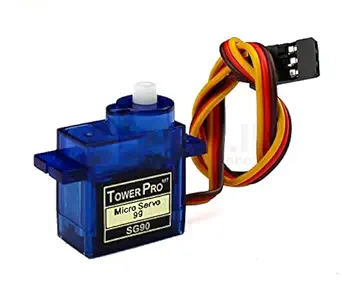        | 1     |
  | L9110 Motor driver         | 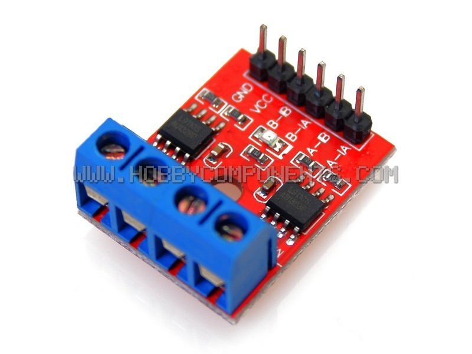       | 1     |
  | AMS1117 3.3v               | 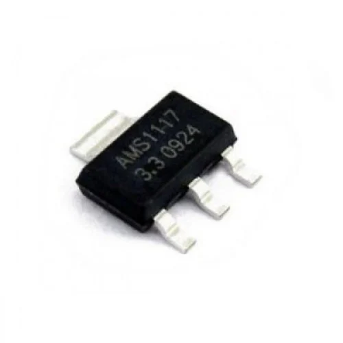     | 1     |
  | PCF8574 I2C IO extender    | 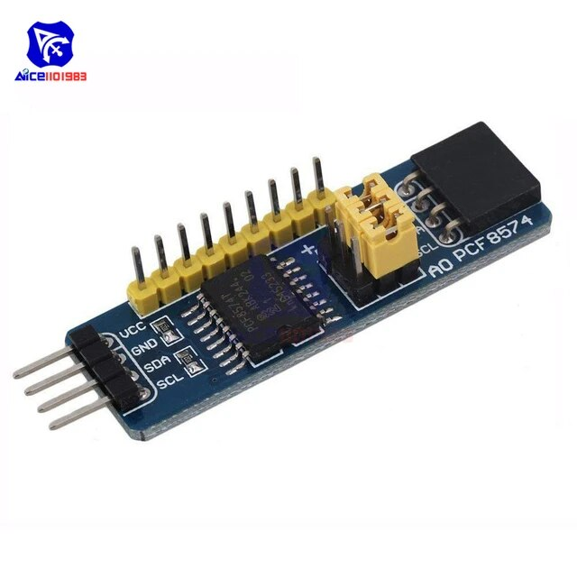      | 1     |
  | Red LED                    | 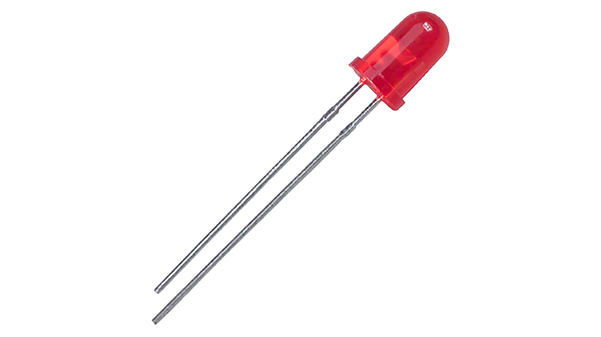     | 2     |
  | Yellow LED                 | 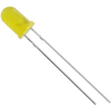   | 4     |
  | White LED                  | 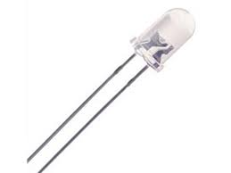    | 4     |
  | 51Ω Resistor               | 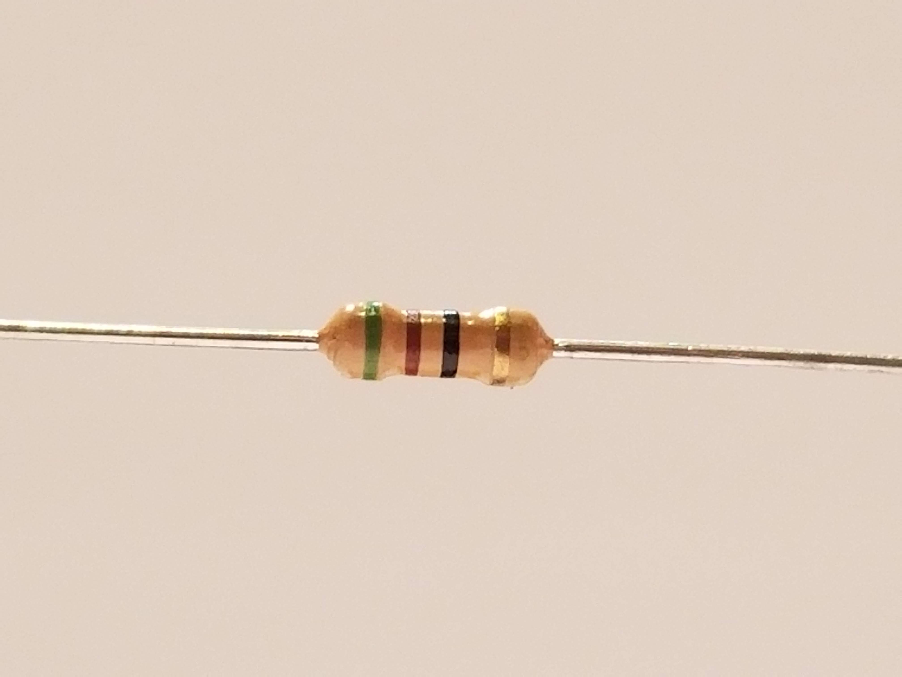           | 1     |
  | 470Ω Resistor              | 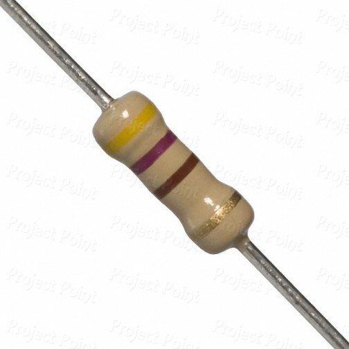          | 4     |
  | 10KΩ Resistor              | 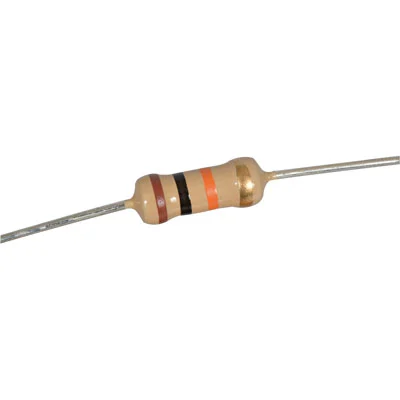         | 2     |
  | 10µF Capacitor             | 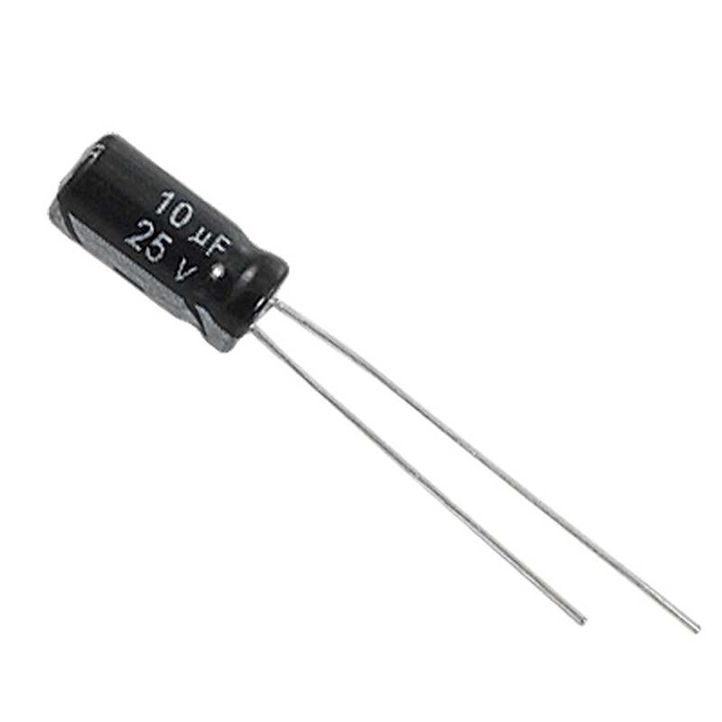     | 1     |
  | 22µF Capacitor             | 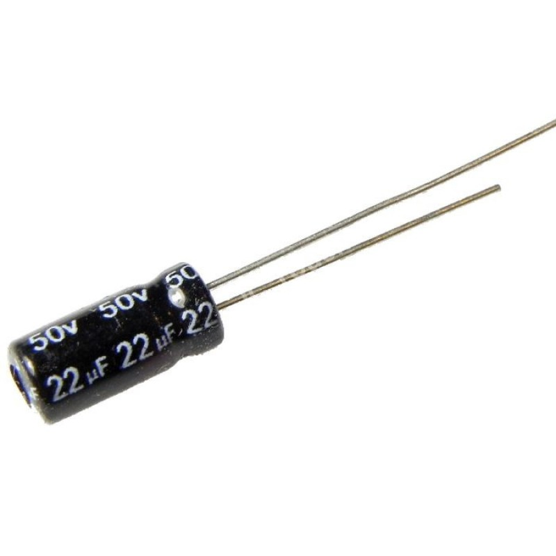         | 1     |
  | 4xAA Battery holder        | 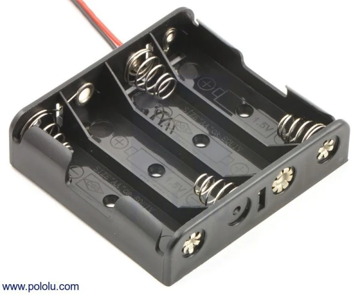  | 1     |
  
